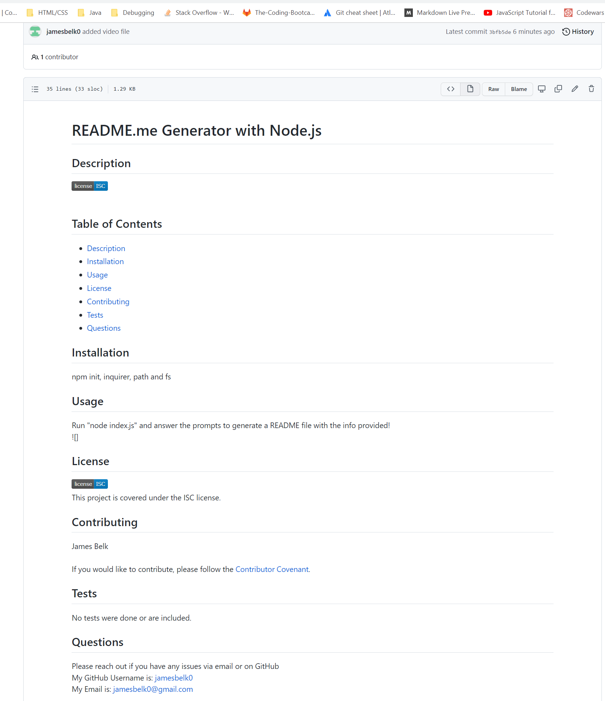

# README.md Generator
## Challenge Assignment 9

## User Story
- AS A developer
- I WANT a README generator
- SO THAT I can quickly create a professional README for a new project

## Acceptance Criteria
- GIVEN a command-line application that accepts user input
- WHEN I am prompted for information about my application repository
- THEN a high-quality, professional README.md is generated with the title of my project and sections entitled Description, Table of Contents, Installation, Usage, License, Contributing, Tests, and Questions
- WHEN I enter my project title
- THEN this is displayed as the title of the README
- WHEN I enter a description, installation instructions, usage information, contribution guidelines, and test instructions
- THEN this information is added to the sections of the README entitled Description, Installation, Usage, Contributing, and Tests
- WHEN I choose a license for my application from a list of options
- THEN a badge for that license is added near the top of the README and a notice is added to the section of the README entitled License that explains which license the application is covered under
- WHEN I enter my GitHub username
- THEN this is added to the section of the README entitled Questions, with a link to my GitHub profile
- WHEN I enter my email address
- THEN this is added to the section of the README entitled Questions, with instructions on how to reach me with additional questions
- WHEN I click on the links in the Table of Contents
- THEN I am taken to the corresponding section of the README

## Link to code:
https://github.com/jamesbelk0/README-Generator

## Link to screenshot/media:
  
A link to the video can be found here: <video src='https://youtu.be/tzR7oWmbIho' width=180/>

## Description
1. Using node.js, capture user input with the inquirer npm and generate a working README.md file.

## Installation
- npm init
- npm install inquirer
## Usage
Run 'node index.js' to get the app running
## Contributor
James Belk
## Questions
If there are any issues or questions, please contact at:
- jamesbelk0@gmail.com
- github.com/jamesbelk0